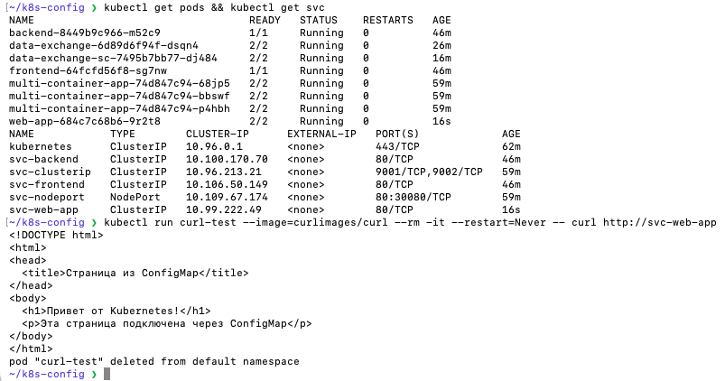
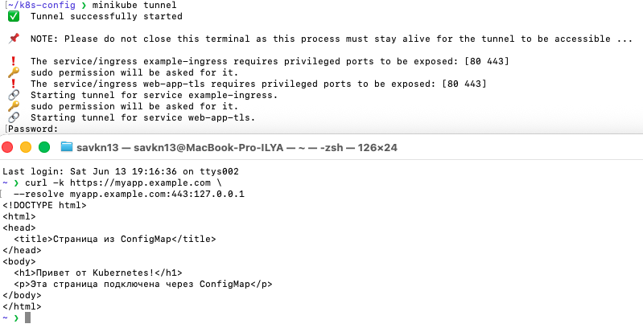
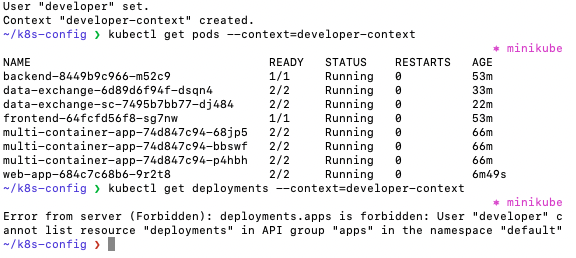

# Домашнее задание к занятию «Настройка приложений и управление доступом в Kubernetes» Савкин ИН

---

## Задание 1. Работа с ConfigMaps

### Манифест ConfigMap (configmap-web.yaml)

```yaml
apiVersion: v1
kind: ConfigMap
metadata:
  name: web-content
data:
  index.html: |
    <!DOCTYPE html>
    <html>
    <head>
      <title>Страница из ConfigMap</title>
    </head>
    <body>
      <h1>Привет от Kubernetes!</h1>
      <p>Эта страница подключена через ConfigMap</p>
    </body>
    </html>
```

### Манифест Deployment (deployment.yaml)

```yaml
apiVersion: apps/v1
kind: Deployment
metadata:
  name: web-app
spec:
  replicas: 1
  selector:
    matchLabels:
      app: web-app
  template:
    metadata:
      labels:
        app: web-app
    spec:
      containers:
      - name: nginx
        image: nginx:latest
        ports:
        - containerPort: 80
        volumeMounts:
        - name: web-content
          mountPath: /usr/share/nginx/html
      - name: multitool
        image: wbitt/network-multitool
        env:
        - name: HTTP_PORT
          value: "8080"
        ports:
        - containerPort: 8080
      volumes:
      - name: web-content
        configMap:
          name: web-content
```

### Проверка доступности

```bash
kubectl run curl-test --image=curlimages/curl --rm -it --restart=Never -- curl http://svc-web-app
```



---

## Задание 2. Настройка HTTPS с Secrets

### Генерация SSL-сертификата

```bash
openssl req -x509 -nodes -days 365 -newkey rsa:2048 \
  -keyout tls.key -out tls.crt -subj "/CN=myapp.example.com"
```

### Создание Secret

```bash
kubectl create secret tls tls-secret \
  --cert=tls.crt \
  --key=tls.key
```

### Манифест Ingress с TLS (ingress-tls.yaml)

```yaml
apiVersion: networking.k8s.io/v1
kind: Ingress
metadata:
  name: web-app-tls
  annotations:
    nginx.ingress.kubernetes.io/rewrite-target: /
spec:
  tls:
  - hosts:
    - myapp.example.com
    secretName: tls-secret
  rules:
  - host: myapp.example.com
    http:
      paths:
      - path: /
        pathType: Prefix
        backend:
          service:
            name: svc-web-app
            port:
              number: 80
```

### Проверка HTTPS-доступа

```bash
minikube tunnel  # в отдельном терминале

curl -k https://myapp.example.com \
  --resolve myapp.example.com:443:127.0.0.1
```



---

## Задание 3. Настройка RBAC

### Генерация сертификата для пользователя developer

```bash
openssl genrsa -out developer.key 2048

openssl req -new -key developer.key \
  -out developer.csr -subj "/CN=developer"

openssl x509 -req -in developer.csr \
  -CA ~/.minikube/ca.crt \
  -CAkey ~/.minikube/ca.key \
  -CAcreateserial \
  -out developer.crt -days 365
```

### Манифест Role (role-pod-reader.yaml)

```yaml
apiVersion: rbac.authorization.k8s.io/v1
kind: Role
metadata:
  name: pod-reader
  namespace: default
rules:
- apiGroups: [""]
  resources:
  - pods
  - pods/log
  verbs:
  - get
  - list
  - watch
```

### Манифест RoleBinding (rolebinding-developer.yaml)

```yaml
apiVersion: rbac.authorization.k8s.io/v1
kind: RoleBinding
metadata:
  name: developer-pod-reader
  namespace: default
subjects:
- kind: User
  name: developer
  apiGroup: rbac.authorization.k8s.io
roleRef:
  kind: Role
  name: pod-reader
  apiGroup: rbac.authorization.k8s.io
```

### Добавление пользователя в kubeconfig

```bash
kubectl config set-credentials developer \
  --client-certificate=developer.crt \
  --client-key=developer.key

kubectl config set-context developer-context \
  --cluster=minikube \
  --namespace=default \
  --user=developer
```

### Проверка прав

```bash
# Разрешено — просмотр подов
kubectl get pods --context=developer-context

# Запрещено — просмотр deployments
kubectl get deployments --context=developer-context
```



Пользователь `developer` может просматривать поды и их логи, но получает ошибку `Forbidden` при попытке получить список deployments — RBAC работает корректно.
